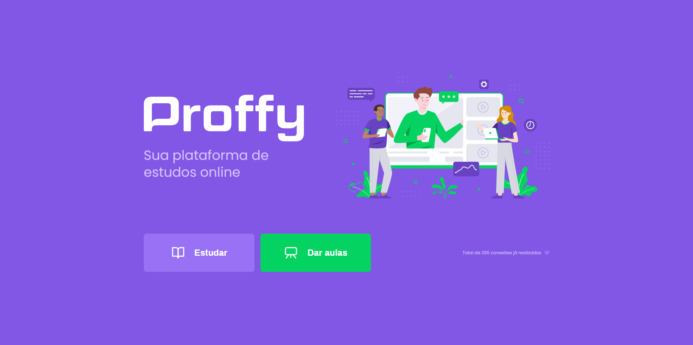
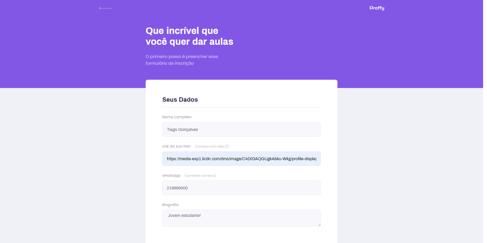

<h2 align="center">Proffys - NLW-2</h2>

___

<h3 align="center">
  <a href="#information_source-sobre">Sobre</a>&nbsp;|&nbsp;
  <a href="#interrobang-motivo">Motivo</a>&nbsp;|&nbsp;
  <a href="#rocket-tecnologias-utilizadas">Tecnologias</a>&nbsp;|&nbsp;
  <a href="#link-como-contribuir">Como Contribuir</a>&nbsp;|&nbsp;
</h3>

___

## :information_source: Sobre

O projeto foi feito com o intuito de ser uma plataforma onde professores podem postar a máteria com o dia e hora que dão aulas para alunos pesquisarem e entrarem em contato com o professor.

## :interrobang: Motivo

O maior motivo foi para participar da nextLevelWeek e adquirir conhecimentos, mas o projeto pode ser melhorado e ser usado sim.

## :rocket: Tecnologias Utilizadas 

O projeto foi desenvolvido utilizando as seguintes tecnologias

- Html
- Css
- JavaScript
- NodeJs

## :link: Como contribuir 

- Faça um Fork do repositório
- Clone o seu repositório
- Crie uma branch com a sua feature
- Faça um commit com suas mudanças
- 'Push' a sua branch
- Ir em Pull Requests do projeto original e criar uma pull request com o seu commit
