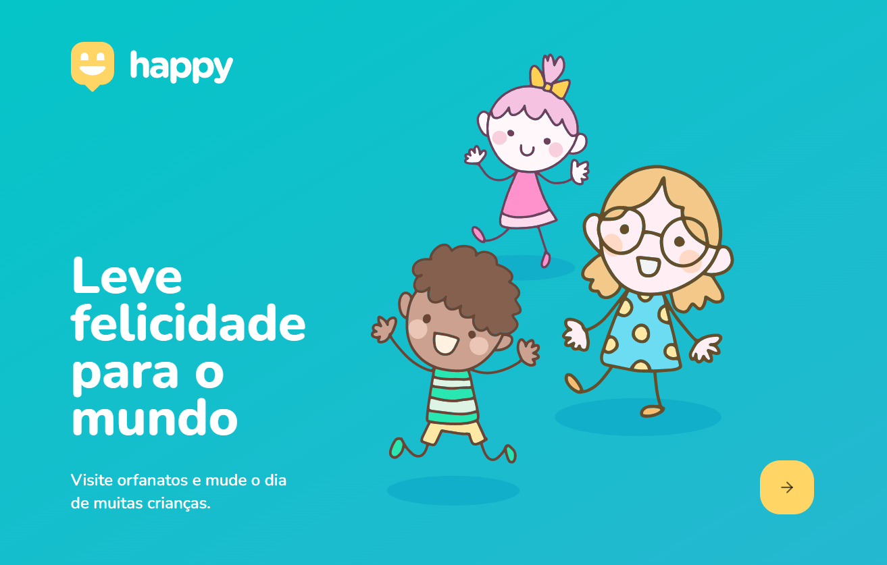

<h1 align="center"> Orphanages </h1>

🔍 Navegação dentro do Readme. 

  
  
  
  

  

  <h1 id="sobre"> ✅ Sobre o projeto </h1>
  

    Projeto desenvolvido para usarem do mapa para criar e ver pontos onde possuem lares para vistação.  
  

 

  <h1 id="diretorios"> 💻 Diretórios </h1>
  Clique nos nomes para saber mais sobre cada diretório.
  

    

      <a 
        href="https://github.com/Tiaguin061/nlw/tree/orphanage-nlw3/frontend"
      >
      Frontend
      </a>: React, Typescript, Leaflet(para mapas)  
      <a 
        href="https://github.com/Tiaguin061/nlw/tree/orphanage-nlw3/backend"
      >
      Backend
      </a>: NodeJs, Typescript, Express, Typeorm, Multer(para arquivos), Sqlite  
      <a 
        href="https://github.com/Tiaguin061/nlw/tree/orphanage-nlw3/mobile"
      >
      Mobile
      </a>: React-Native, Typescript, Expo
    

  ___
  

 
 

  <h1 id="rede-social">📱 Minhas redes sociais</h1>
  
 Eu me chamo Tiago Gonçalves, abaixo deixo os links das minhas principais redes na qual participo.
  

  
  
  
  

 

  <h1 id="contribuir">🔗 Como contribuir com o projeto</h1>
  

    
 1° - Faça um Fork do repositório; 

    
 2° - Clone o repositório; 

    
 3° - Crie uma branch com a sua feature; 

    
 4° - Faça um commit bem descritivo com suas mudanças; 

    
 5° - Dê 'Push' a sua branch; 

    
 6° - Ir em Pull Requests do projeto original e criar uma pull request com o seu commit; 

    

     ➡ Caso tenha dúvidas sobre como criar um pull request, 
      <a 
        href="https://docs.github.com/pt/github/collaborating-with-issues-and-pull-requests/creating-a-pull-request"> clique neste link.
      </a>  
    

  

